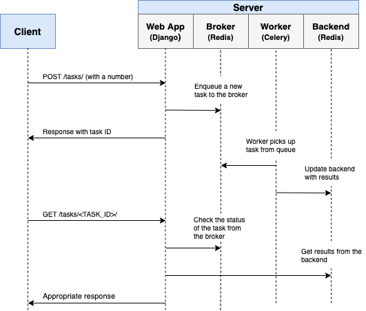
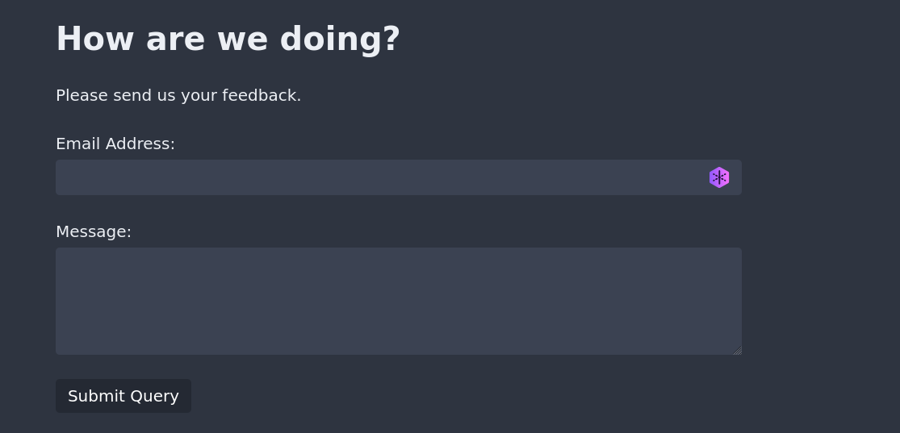

# Asynchronous Tasks with Django, Celery and Redis

Celery is a distributed task queue for UNIX systems. It allows you to offload work from your Python app. Once you integrate Celery into your app, you can send time-intensive tasks to Celery’s task queue. That way, your web app can continue to respond quickly to users while Celery completes expensive operations asynchronously in the background.

Even though both of these functionalities are part of Celery, they’re often addressed separately:

1. Celery workers are worker processes that run tasks independently from one another and outside the context of your main service.
2. Celery beat is a scheduler that orchestrates when to run tasks. You can use it to schedule periodic tasks as well.

Applications of celery can include intensive, time consuming tasks such as: Email sending, image processing, text processing, data analysis, machine learning model runs, report generation.

In this project, I have just setup a form for emailing the users. Considering there are lot of users checking the website, it can be really time consuming, I have simulated this by just time.sleep(20), this will make the Django app slow simulating the condition when lot of users are using the app.

I have solved this problem by integrating Celery which will act as the consumer, django app will act as the producer, redis will act as the broker and backend database. Because of this architecture, the time delay is reduced to 0.7 seconds from 20 seconds. Refer to the following image:




## Setup

To try the project, set up a virtual environment and install the listed dependencies:

```sh
python -m venv venv
source venv/bin/activate
python -m pip install -r requirements.txt
```

You'll also need to install Redis on your system:

```sh
sudo apt install redis
```

Once you've installed all the dependencies, you need to start three processes that need to run at the same time:

1. Django
2. Redis
3. Celery

To get all of them running, open three different terminal windows and start them one-by-one:

**Django app:**

```sh
(venv) $ python manage.py migrate
(venv) $ python manage.py runserver
```

**Redis server:**

```sh
redis-server
```

**Celery:**

```sh
(venv) $ python -m celery -A django_celery worker -l info
```

When all three processes are running, you can go to `localhost:8000/` and submit a feedback response. Celery will simulate a work-intensive process and send an email at the end of it. You'll see the email message show up in the log stream on the terminal window where the Celery worker is running.
